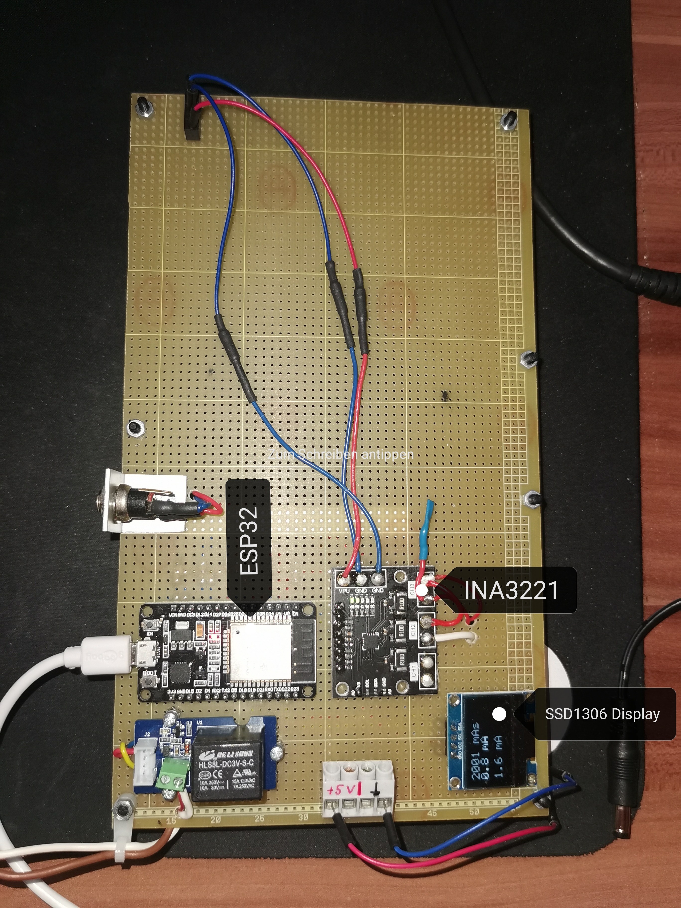

# Power Measurement Framework for edge-enabled IoT devices

Measure the power consumption of serverless functions executed on edge-enabled devices and push the data to the existing Function Delivery Network (FDN) infrastructure (Prometheus & Grafana). 
The power consumption measurements are carried out by a ESP32 powermeter.

### Hardware Setup

- `INA3221`: the power measurement sensor with three channels
- `ESP32`: the microcontroller where the main software runs
- `SSD1306`: display that can optionally be used to display power measurements.

 

### Table of Contents
#### Main components
- `udp_client`: Contains the source code for the UDP client that can be used at the edge devices.
- `esp32_measurement_node`: Contains the source code for the ESP32 powermeter that measures the power consumption and sends them to the edge devices via UDP communication.
- `functions`: Contains the serverless function(s) to apply for tests.

#### Test utils
- `test-utils`: scripts and utilities to test functionality.

#

### Useful links
- [Espressif ESP32 Development Environment](https://docs.espressif.com/projects/esp-idf/en/latest/esp32/get-started/index.html)
- [VSCode ESP32 IDF Plugin Docs](https://github.com/espressif/vscode-esp-idf-extension/blob/master/docs/tutorial/toc.md)
- [INA3221 Strommessung](https://www.raspberry-pi-geek.de/ausgaben/rpg/2019/02/strom-und-spannungssensor-ina3221/)

#

### TO-DOs
- [x] Setup UDP connection between ESP32 and Jetson Nano
- [x] Send energy measurements to the Jetson Nano
- [ ] Store received energy measurements on the Jetson Nano
- [x] Install Grafana & Prometheus on local k8s
- [x] Write custom prometheus exporter for the power measurements so prometheus is able to poll the data - use sample data until later
- [x] Test custom prometheus exporter in test k8s
- [ ] Adjust prometheus exporter so it exposes the power measurements to prometheus instead of sample data
- [x] Adjust code in powermeasurement component to measure power consumption of multiple devices (multiple channels)
- [ ] Adjust code to make it possible to use more than 1x INA3221 (-> project configuration).
- [x] Make UDP client send a certain channel ID to demand the power measurements for it instead of hardcoding channel 3 
- [x] Adjust code in UDP server to send the correct power measurements to multiple connected clients / devices
- [x] Expand the hardware setup to 1x Jetson Nano + 1x ESP32 and make sure it works
- [ ] Deploy the exporter for the ESP32 and expand the grafana dashboard with a panel for the ESP32 exporter (-> Setup: 2x exporters / 2 panels in grafana)
